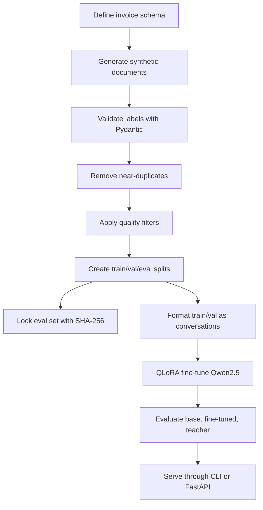

# Forge Interview Prep

## Project Summary

Forge is a model-distillation pipeline for structured invoice extraction. It uses a teacher LLM to generate labeled invoice examples, curates those examples with a schema-first pipeline, fine-tunes a smaller Qwen2.5 Instruct model with QLoRA, evaluates outputs deterministically against a locked held-out set, and serves extraction through CLI or FastAPI.

## Strong 30-Second Pitch

I built Forge to test whether a narrow document extraction workload could move from a frontier API to a small local model. The pipeline defines a strict Pydantic invoice schema, generates synthetic labeled invoices through DeepSeek on OpenRouter, curates the data with validation, deduplication, and quality filters, locks a held-out eval set with a checksum, formats the data for instruction tuning, and supports QLoRA fine-tuning of Qwen2.5 with Unsloth. Evaluation is deterministic field-level scoring rather than LLM-as-judge, and the result can be served locally through FastAPI or a CLI.

## Tech Stack

| Area | Tools |
| --- | --- |
| Language | Python 3.11+ |
| Schema | Pydantic v2 |
| Teacher API | OpenRouter, OpenAI-compatible SDK, DeepSeek model family |
| Student model | Qwen2.5 Instruct |
| Fine-tuning | Unsloth, TRL SFTTrainer, PEFT |
| Quantization | bitsandbytes 4-bit NF4 |
| Dataset format | ShareGPT / ChatML |
| Evaluation | deterministic Python scoring |
| Serving | FastAPI, Uvicorn, Transformers, PEFT |
| Local deployment | optional GGUF / Ollama path |
| Tests | pytest |

## End-to-End Flow

## Techniques To Know

### Knowledge Distillation

Distillation transfers task-specific behavior from a stronger or more expensive teacher model into a smaller student model. In this project, the teacher produces labeled invoice examples and can also serve as a comparison baseline. The student learns the narrow extraction behavior so inference can run locally.

### Schema-First Extraction

The Pydantic schema is the contract. It defines required fields, optional fields, nested line items, ISO date strings, ISO currency codes, decimal tax rates, and basic numeric constraints. This prevents drift between generation, training, evaluation, and serving.

### Synthetic Data Generation

The generator samples from 20 scenario configurations across easy, medium, and hard invoice types. This creates variety in layouts, currencies, tax formats, missing fields, negative line items, service invoices, receipts, and international formats.

### Curation Pipeline

The curation pipeline is not a rubber stamp:

- Schema validation catches malformed labels.
- Deduplication uses normalized character shingles and Jaccard similarity to remove structurally repeated examples.
- Quality filters remove degenerate examples.
- Stratified splitting preserves difficulty mix across train, validation, and eval.

### Eval Locking

The eval file is created before training and protected by a SHA-256 checksum. This prevents accidental or intentional edits after seeing model performance. It is a strong answer to data leakage questions.

### QLoRA

QLoRA loads the base model in 4-bit quantization and trains small LoRA adapter matrices while freezing the base weights. This reduces memory use and makes fine-tuning feasible on constrained GPUs such as Colab T4.

Key config concepts:

- `r`: adapter rank; higher means more trainable capacity.
- `lora_alpha`: scaling factor for adapter updates.
- `lora_dropout`: regularization.
- `target_modules`: attention and MLP projection layers to adapt.
- NF4 quantization: 4-bit format designed for neural network weights.

### Deterministic Evaluation

The evaluator parses model output as JSON, validates it with Pydantic, then compares fields against ground truth. Numeric fields are rounded to two decimals, strings are normalized for case/whitespace, and line items are greedily matched by description similarity plus total match. This is more defensible than asking another LLM whether the answer looks right.

## What To Be Honest About

The committed repository currently includes the data pipeline and curated splits, but it does not include trained adapter weights or committed evaluation result JSON files. If asked about final accuracy, point to the reproducible eval machinery and say the actual number must be backed by `evaluation/results/*.json` and the training run log.

Good wording:

> The pipeline is built to produce a defensible base-vs-fine-tuned-vs-teacher comparison. The committed repo includes the locked 91-example eval set and scoring code. I would only claim a final accuracy number when the result JSON and training run artifacts are attached.

Avoid saying:

> The repo proves 90% accuracy.

unless the model adapter and eval results are available.

## Likely Interview Questions

### Why not just use a frontier API?

For high-volume, repetitive extraction, frontier APIs add marginal cost, latency, privacy exposure, and vendor dependency. A specialized local model can be cheaper and more controllable if it reaches acceptable accuracy.

### Why use synthetic data?

Real labeled invoices are hard to get and may contain sensitive data. Synthetic generation lets the project bootstrap diverse examples cheaply. The limitation is domain realism, so production validation would require real invoices.

### How did you avoid data leakage?

The split script samples the eval set before training, writes it to `data/eval_locked.jsonl`, and records a SHA-256 checksum. The eval runner verifies the checksum before scoring.

### Why Pydantic?

It turns the extraction schema into executable validation. The same model is used by generation checks, curation, evaluation, and serving, so field definitions do not drift.

### Why QLoRA instead of full fine-tuning?

Full fine-tuning all model weights is expensive in memory and compute. QLoRA freezes the quantized base model and trains only small adapter matrices, which is enough for a narrow structured-output task.

### How are line items scored?

Line items are nested arrays, so exact index matching can be brittle. The scorer greedily matches each ground-truth item to the best predicted item using description similarity and total amount, then scores description, quantity, unit price, and total.

### What would you improve next?

- Commit a real training run log.
- Publish the LoRA adapter or a reproducible Hugging Face artifact link.
- Commit base, fine-tuned, and teacher eval JSON files.
- Validate on real invoices.
- Add CI for schema/scoring tests.
- Add structured JSON repair or constrained decoding for serving.
- Add batch inference and observability for production usage.

