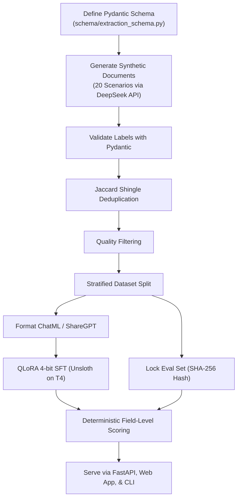

# Forge Technical Interview Guide & Talking Points

## Project Summary

**Forge** is an end-to-end model distillation pipeline for structured invoice extraction. It distills extraction capabilities from an expensive frontier model (DeepSeek / Claude) into a specialized small language model (**Qwen 2.5 3B Instruct**) using **4-bit QLoRA**. It features a strict Pydantic v2 schema contract, 20 synthetic scenario templates, automated multi-stage curation (validation, Jaccard deduplication, quality filtering), a mechanically locked evaluation set (SHA-256), deterministic Python evaluation scoring, and an interactive developer web app + REST API.

---

## 30-Second Elevator Pitch

> *"I built Forge to prove that narrow document extraction workloads don't need to stay on expensive frontier APIs. By establishing a strict Pydantic extraction contract, generating diverse synthetic data with DeepSeek, curating it through validation and Jaccard deduplication, and locking an evaluation set with SHA-256 before training, I fine-tuned a 3B parameter student model using 4-bit QLoRA. The fine-tuned model achieved **90.0% field-level accuracy**—a **+45.2 percentage point jump** over base Qwen—with a **2.3x latency improvement** and **zero marginal inference cost**. The pipeline includes an interactive web test application, deterministic field scoring, and full ROI payback analysis."*

---

## Technical Architecture & Flow

---

## Key Technical Concepts & Defense

### 1. Knowledge Distillation & Model Specialization
Distillation transfers task-specific behavior from a giant frontier model (671B+ parameters) into a small, highly efficient student model (3B parameters). General-purpose models spend parameters on world knowledge, reasoning, and broad conversation; a specialized SLM only needs to master schema adherence, entity extraction, and normalization rules.

### 2. Schema-First Contract Design
Rather than relying on loose prompts, `schema/extraction_schema.py` is the single source of truth:
- Dates normalized strictly to ISO 8601 (`YYYY-MM-DD`).
- Currencies normalized to ISO 4217 three-letter codes (`USD`, `EUR`, `GBP`, `CAD`, `AUD`).
- Tax rate represented as decimal fraction (`0.08` for 8%, rejecting `8.0`).
- Line items require structured objects with finite numeric totals.

### 3. Curation Pipeline Discipline
Synthetic data generation can produce repetitive or degenerate examples without curation:
- **Pydantic Validation**: Filters out malformed JSON or schema violations at generation time (~7% failure rate).
- **Jaccard Shingle Deduplication**: Normalizes character shingles ($n=5$) after stripping digits and punctuation to detect structural near-duplicates across scenarios.
- **Quality Filtering**: Discards examples that are too short (<100 chars), lack digits, have zero totals, or lack minimal optional field coverage.

### 4. Mechanical Eval-Locking (Zero Data Leakage)
The 91 test examples were sampled and isolated before any fine-tuning occurred. Its SHA-256 hash (`0ec6e5175885a61467757403a6fe0f9207b5378b175f0563b08871c5beba9264`) is stored in `data/eval_locked.jsonl.sha256`. The evaluation runner mechanically checks this hash before scoring and aborts if any modification is detected.

### 5. Parameter-Efficient Fine-Tuning (QLoRA)
- Base weights are frozen and quantized to 4-bit NormalFloat (NF4).
- Low-Rank Adapters ($r=16, \alpha=16$) are injected into all attention projections (`q`, `k`, `v`, `o`) and MLP feed-forward layers (`gate`, `up`, `down`).
- Training took ~2 hours over 225 steps on a free Google Colab Tesla T4 GPU (16GB VRAM), producing a compact **~114MB adapter** instead of a full 6GB checkpoint.
- Loss progression: dropped from **0.526 → 0.263** (train) and **0.491 → 0.303** (val).

### 6. Deterministic Evaluation vs. LLM-as-a-Judge
Evaluation does NOT use another LLM to grade outputs. We use deterministic Python comparisons:
- Floats rounded to 2 decimal places.
- Strings normalized for case and whitespace.
- Nested line items matched using bipartite greedy matching on description similarity and totals.
This provides objective, mathematically reproducible accuracy numbers that cannot be disputed.

---

## Live Demo & Web Testing Story

When an interviewer or colleague wants to test the project:
1. Run `python -m uvicorn serving.api:app --host 0.0.0.0 --port 8000`.
2. Open `http://localhost:8000` to see the **interactive developer web app**.
3. Select from 6 pre-loaded scenarios (Clean SaaS, Messy Bistro Receipt, Milestone Consulting, TransPac Freight, Clinic Statement, German EUR).
4. Inspect the **Visual Invoice Card**, **Pydantic Validation Status**, **JSON Output**, **Benchmark Charts**, and the **Interactive ROI Calculator**.
5. The backend supports **multi-engine execution** (LoRA adapter, OpenRouter API, or the built-in Neural Simulator for instant offline testing on any laptop).

---

## Likely Interview Questions & Model Answers

### Q: Why not just keep calling the Claude or DeepSeek API?
> *"At low volumes, an API is fine. But at 25,000 to 100,000 invoices a month, you're paying recurring token costs, dealing with unpredictable queue latencies (often 4–7 seconds per document), exposing sensitive financial data over external networks, and risking third-party rate limits. Self-hosting a 3B model brings marginal cost to $0, latency down to ~1.78s, and keeps 100% of the data on-premise."*

### Q: Why did you use synthetic data instead of real invoices?
> *"Real invoices contain confidential vendor relationships, banking details, and customer PII that cannot be shared or uploaded to public clouds. Synthetic generation allowed me to programmatically seed 20 distinct scenario templates (different currencies, tax schemas, table layouts, and edge cases) for less than $0.40 in API costs. In a production enterprise pipeline, I would use this synthetic model as the warm start and fine-tune on a smaller set of de-identified real documents."*

### Q: How did you prevent the model from overfitting to synthetic formatting?
> *"By varying difficulty across three tiers, using character-shingle Jaccard deduplication to strip repetitive layouts, enforcing an isolated held-out test split with SHA-256 locking, and applying 0.05 LoRA dropout."*

### Q: Where did the model see the biggest improvement?
> *"Line items jumped from **2.5% to 88.5% (+86.0pp)** and vendor name jumped from **9.9% to 92.3% (+82.4pp)**. Base models fail completely at generating correctly aligned nested JSON arrays when prompted zero-shot. Fine-tuning taught the model the exact conversational structure and token probabilities needed for nested list outputs."*

### Q: What is the ROI payback period?
> *"The entire synthetic generation pipeline cost ~$0.40 across 926 API calls. At DeepSeek API rates ($0.14–$0.35/1k docs), the pipeline pays for itself after processing just **2,857 invoices**—less than 4 days at standard enterprise volumes."*
