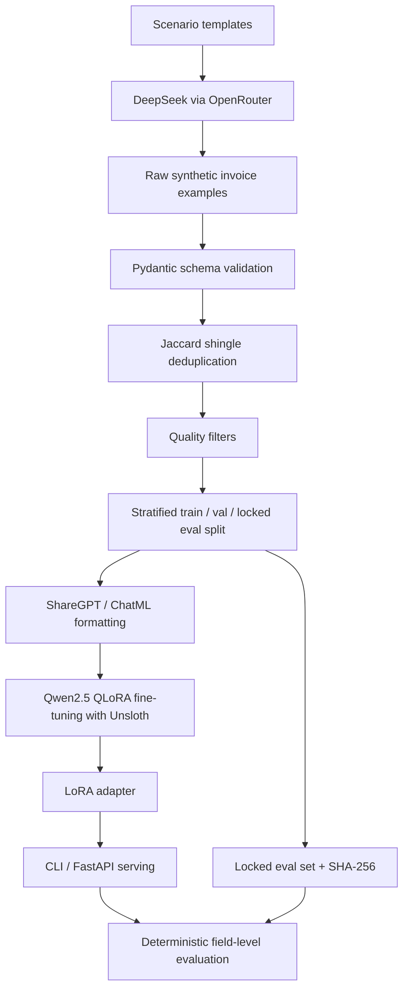

# Forge - Model Distillation for Structured Invoice Extraction

Forge is an end-to-end pipeline for turning a frontier-model invoice extraction workflow into a smaller local model workflow. It covers synthetic data generation, schema-first curation, instruction-tuning dataset formatting, QLoRA fine-tuning scaffolding, deterministic evaluation, and local serving.

The project is designed around one practical question: why keep paying a frontier API for a narrow, repeatable extraction task once a small open-weight model can learn the schema and normalization rules?

## Current Repository Status

This repository contains the implemented data, curation, evaluation, and serving code plus a committed curated dataset split:

| Artifact | Status |
| --- | --- |
| Synthetic generation code | Implemented |
| Raw generation summary | 1,000 requested, 926 generated |
| Curated train split | 600 examples |
| Validation split | 67 examples |
| Locked eval split | 91 examples |
| Eval checksum | Present and verified |
| QLoRA training notebook | Present |
| FastAPI and CLI serving code | Present |
| Committed model adapter weights | Not committed |
| Committed eval result JSON files | Not committed |

Earlier docs referenced final benchmark numbers, but this repo does not currently commit the model adapter or `evaluation/results/` files needed to independently verify those numbers. See [RESULTS.md](RESULTS.md) for the evidence-backed status.

## Architecture



## Tech Stack

- Python 3.11+
- Pydantic v2 for schema validation
- OpenRouter with the OpenAI-compatible SDK for teacher-model calls
- DeepSeek model family for synthetic data generation and teacher evaluation
- Qwen2.5 Instruct as the student model
- Unsloth, TRL, PEFT, Transformers, Accelerate, and bitsandbytes for QLoRA fine-tuning
- 4-bit NF4 quantization for memory-efficient training and inference
- FastAPI and Uvicorn for HTTP serving
- pytest for deterministic unit tests
- Optional GGUF / Ollama export path for local deployment

## Repository Layout

```text
schema/
  extraction_schema.py        Pydantic invoice extraction schema
data_generation/
  prompts.py                  20 scenario templates
  generate_synthetic_data.py  OpenRouter generation runner
data_curation/
  validate_schema.py          Pydantic validation pass
  deduplicate.py              Jaccard shingle near-duplicate removal
  quality_filter.py           Heuristic curation filters
  split_dataset.py            Stratified split and eval checksum lock
training/
  format_dataset.py           ShareGPT / ChatML formatter
  config.py                   QLoRA training configuration
  *.ipynb                     Colab training and evaluation notebooks
evaluation/
  scoring.py                  Deterministic scoring implementation
  run_eval.py                 Teacher/base/fine-tuned eval runner
serving/
  api.py                      FastAPI service
  cli.py                      Ollama/Hugging Face CLI
  export_gguf.py              GGUF/Ollama export helper
tests/
  test_schema_validation.py
  test_scoring.py
```

## Key Design Decisions

The schema is the source of truth. Generation prompts, validators, dataset formatting, evaluation, and serving all target the same `InvoiceExtraction` model.

Evaluation is deterministic. The project scores schema validity, top-level field accuracy, nested line-item accuracy, and full-record exact match with normal Python comparisons rather than an LLM judge.

The eval set is locked. `data/eval_locked.jsonl` has a SHA-256 checksum, and the eval runner aborts if the file changes.

The model is trained as a specialist. QLoRA freezes the quantized base model and trains small adapter matrices, making the training path feasible on limited GPU memory.

## Quick Start

Create an environment and install development dependencies:

```powershell
python -m venv .venv
.\.venv\Scripts\activate
python -m pip install -e ".[dev]"
```

Run tests:

```powershell
python -m pytest
```

Format the training data:

```powershell
python -m training.format_dataset --input data/train.jsonl --output data/train_formatted.jsonl
python -m training.format_dataset --input data/val.jsonl --output data/val_formatted.jsonl
```

Run teacher evaluation, if `OPENROUTER_API_KEY` is configured:

```powershell
python -m evaluation.run_eval --model-type teacher --output evaluation/results/teacher_model_results.json
```

Run local Hugging Face evaluation, if the model is available:

```powershell
python -m evaluation.run_eval --model-type base --hf-model Qwen/Qwen2.5-3B-Instruct --load-in-4bit
python -m evaluation.run_eval --model-type finetuned --hf-model path/to/merged_model --load-in-4bit
```

Start the API once a LoRA adapter is available locally or on Hugging Face:

```powershell
python -m uvicorn serving.api:app --host 0.0.0.0 --port 8000
```

## Interview Guide

See [INTERVIEW_PREP.md](INTERVIEW_PREP.md) for the system explanation, talking points, tradeoffs, and questions to prepare for.
