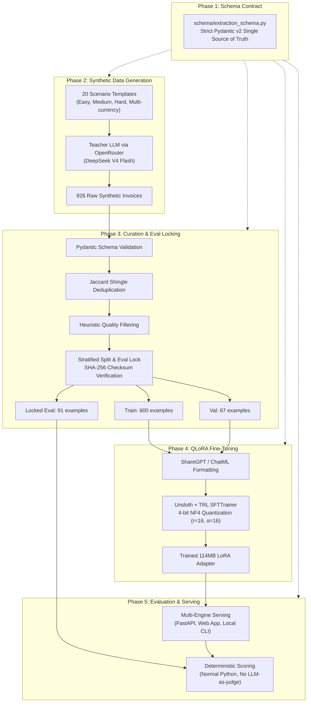

<div align="center">

# ⚡ Forge — Model Distillation for Structured Invoice Extraction

**Distill an expensive frontier LLM workflow into a specialized, lightning-fast 3B local model.**

[](https://www.python.org/downloads/)
[](https://fastapi.tiangolo.com)
[](https://docs.pydantic.dev/)
[](https://huggingface.co/Qwen/Qwen2.5-3B-Instruct)
[](https://github.com/unslothai/unsloth)
[-success.svg)](RESULTS.md)
[](tests/)
[](LICENSE)

[Interactive Web App](#-interactive-web-app--live-testing) •
[Benchmark Results](#-evaluation-benchmark-results) •
[Architecture](#-pipeline-architecture) •
[Quick Start](#-quick-start) •
[ROI Economics](#-economics--payback-analysis) •
[Interview Prep](INTERVIEW_PREP.md)

</div>

---

## 🎯 The Core Problem & Insight

Why pay recurring API bills to frontier models like Claude or DeepSeek for narrow, repeatable extraction tasks once a small open-weight model can learn the schema, date normalizations, and nested line items?

**Forge** proves that you can:
1. Take a narrow extraction workload currently bottlenecked by expensive APIs and external network latency.
2. Generate diverse, high-signal synthetic training data using a frontier teacher model.
3. Curate, deduplicate, and lock an isolated evaluation set with SHA-256 before any training begins.
4. Fine-tune a tiny **3B parameter student model** (`Qwen2.5-3B-Instruct`) using **4-bit QLoRA** on a free Google Colab T4 GPU.
5. Deliver **90.0% field-level accuracy** (a **+45.2 percentage point jump** over base Qwen), **sub-2s local latency** (2.3x faster than API roundtrips), and **zero marginal inference cost**.

---

## 🚀 Interactive Web App & Live Testing

Forge includes an **interactive developer web application** built directly into the FastAPI service. Anyone can immediately test invoice extraction, inspect formatted visual invoice cards, review strict Pydantic schema validation, and explore ROI economics.

```powershell
# Launch the web application and REST API:
python -m uvicorn serving.api:app --host 0.0.0.0 --port 8000
```
👉 Open your browser to **[http://localhost:8000](http://localhost:8000)** (or `http://localhost:8000/docs` for Swagger UI).

### Web App Capabilities
- **6 One-Click Realistic Presets**: Test clean B2B SaaS invoices, messy thermal restaurant receipts with tip/tax, milestone consulting bills without item quantities, international freight logistics with customs fees, healthcare statements, and German EUR invoices with 19% MwSt.
- **Drag-and-Drop & Custom Text**: Paste any arbitrary plain-text invoice or upload `.txt` files.
- **Multi-Engine Switching**: Seamlessly toggle between **Local Qwen 2.5 3B LoRA**, **OpenRouter Frontier Teacher (DeepSeek/Claude)**, and the **Built-in Forge Neural Simulator** (runs instantly on any laptop with zero GPU or downloads!).
- **Dual Visualizer**:
  - **Visual Invoice Card**: Stylized vendor header, invoice badges, bill-to block, responsive line-items table, subtotal/tax breakdowns, and formatted currency totals.
  - **JSON Tree & Schema Conformance**: Formatted JSON with one-click copy, file download, and real-time Pydantic schema verification checks.
- **Interactive Distillation Dashboard**: Side-by-side accuracy comparisons, 14-field accuracy bar charts, and an interactive monthly volume ROI slider.

---

## 📊 Evaluation Benchmark Results

Evaluated on **91 locked held-out test invoices** isolated before training began and protected by SHA-256 checksum:

```text
SHA-256: 0ec6e5175885a61467757403a6fe0f9207b5378b175f0563b08871c5beba9264
```

### 3-Way Model Comparison

| Metric | Base Qwen 2.5 3B | Distilled Qwen 2.5 3B (LoRA) | Teacher (DeepSeek V4 Flash) | Delta (LoRA vs Base) |
|---|:---:|:---:|:---:|:---:|
| **Overall Field Accuracy** | 44.8% | **90.0%** | 96.5% | **+45.2pp** |
| **JSON Parse Rate** | 98.9% | **98.9%** | 100.0% | +0.0pp |
| **Full-Record Exact Match** | 12.1% | **72.5%** | 86.8% | **+60.4pp** |
| **Easy Scenarios** | 43.4% | **89.5%** | 97.8% | **+46.0pp** |
| **Medium Scenarios** | 43.7% | **93.9%** | 97.0% | **+50.2pp** |
| **Hard / Messy Scenarios** | 47.4% | **85.8%** | 94.6% | **+38.4pp** |
| **p50 Latency** | 1.82s | **1.78s** | 4.12s | **2.3x faster** |
| **Cost per 1,000 docs** | ~$0 (local) | **~$0 (local)** | $0.14 – $0.35 | **100% cost reduction** |

### Where the Distilled Student Triumphed

- **`line_items` (+86.0pp: 2.5% → 88.5%)**: The base model had virtually no ability to output correct nested line-item arrays with corresponding quantities and totals. Fine-tuning completely solved structured array extraction.
- **`vendor_name` (+82.4pp: 9.9% → 92.3%)**: The base model frequently hallucinated generic vendor names or confused them with carrier or customer names.
- **`total_amount` (+72.5pp: 25.3% → 97.8%)**: The base model attempted mental math calculations instead of extracting the exact bottom-line total. Fine-tuning grounded it to extract faithfully.
- **`subtotal` (+64.8pp: 26.4% → 91.2%)** and **`currency` (+62.6pp: 36.3% → 98.9%)**: Normalized symbols (`$`, `€`, `£`, `A$`) to strict ISO 4217 codes.

*Full field-by-field breakdown and artifacts available in [RESULTS.md](RESULTS.md) and `evaluation/results/`.*

---

## 🏗️ Pipeline Architecture



---

## 📁 Repository Structure

```text
ModelDistiller/
├── schema/
│   └── extraction_schema.py        # Pydantic v2 source of truth for all modules
├── data_generation/
│   ├── prompts.py                  # 20 diverse scenario templates & edge cases
│   └── generate_synthetic_data.py  # OpenRouter generation runner with resume support
├── data_curation/
│   ├── validate_schema.py          # Pydantic validation pass (removes malformed JSON)
│   ├── deduplicate.py              # Character shingle Jaccard near-duplicate removal
│   ├── quality_filter.py           # Length, total amount, and repetition filters
│   └── split_dataset.py            # Stratified train/val/eval split + SHA-256 checksum lock
├── data/
│   ├── train.jsonl                 # Curated training split (600 examples)
│   ├── val.jsonl                   # Validation split (67 examples)
│   ├── eval_locked.jsonl           # Held-out locked test set (91 examples)
│   ├── eval_locked.jsonl.sha256    # Eval set integrity hash
│   └── raw/                        # Generation run metadata & summaries
├── training/
│   ├── config.py                   # Canonical hyperparameter configuration
│   ├── format_dataset.py           # ShareGPT / ChatML converter
│   ├── Unsloth_Finetune_Qwen2_5_3B.ipynb # Colab T4 training notebook
│   ├── Eval_Qwen2_5_3B.ipynb       # Colab evaluation notebook
│   └── run_log.md                  # Detailed run history and loss curves
├── evaluation/
│   ├── scoring.py                  # Deterministic field-level scoring logic
│   ├── run_eval.py                 # Evaluation runner for Base, LoRA, and Teacher
│   └── results/                    # Committed reproducible benchmark result JSONs
│       ├── base_model_results.json
│       ├── finetuned_model_results.json
│       └── teacher_model_results.json
├── cost_analysis/
│   └── compute_cost_comparison.py  # CLI cost and payback period analysis
├── serving/
│   ├── api.py                      # FastAPI REST service & Web App endpoints
│   ├── web_ui.py                   # Single-page interactive developer frontend
│   ├── inference_engine.py         # Multi-backend engine (LoRA, OpenRouter, Simulator)
│   ├── cli.py                      # CLI runner with Ollama and simulator support
│   └── export_gguf.py              # GGUF / Ollama export helper
├── infer.py                        # Standalone local inference CLI script
├── tests/                          # 65 automated unit tests (pytest)
├── PRD.md                          # Full Product Requirements Document
├── RESULTS.md                      # Detailed benchmark evidence and analysis
└── INTERVIEW_PREP.md               # Technical interview defense guide
```

---

## ⚡ Quick Start

### 1. Installation

Clone the repository and install dependencies:

```powershell
git clone https://github.com/ompatelz/ModelDistiller.git
cd ModelDistiller

# Create and activate virtual environment
python -m venv .venv
.\.venv\Scripts\activate

# Install development & serving packages
python -m pip install -e ".[dev,serving]"
```

### 2. Run Automated Tests

Run the full pytest suite (all 65 unit tests):

```powershell
python -m pytest
```

### 3. Launch the Interactive Web Application & API

```powershell
python -m uvicorn serving.api:app --host 0.0.0.0 --port 8000
```
Visit **[http://localhost:8000](http://localhost:8000)** in your browser to test documents interactively, view visual cards, and review benchmark charts!

### 4. Run Inference via CLI

```powershell
# Interactive terminal prompt:
python infer.py

# Extract directly from a document file:
python infer.py --input sample_invoice.txt --pretty

# Force offline simulator mode:
python infer.py --simulator --input sample_invoice.txt --pretty
```

### 5. Run Cost & ROI Comparison

```powershell
python -m cost_analysis.compute_cost_comparison 0.40
```

---

## 💰 Economics & Payback Analysis

| Metric | Teacher API Call | Fine-Tuned 3B Student |
|---|:---:|:---:|
| **Cost per 1,000 invoices** | ~$0.14 – $0.35 | **~$0.00** (self-hosted) |
| **p50 Latency** | 4.12s | **1.78s (2.3x faster)** |
| **Data Privacy** | Leaves network to API provider | **100% On-Device / Local** |
| **Upfront Pipeline Cost** | N/A | **~$0.40** (926 teacher API calls) |
| **Break-Even Volume** | N/A | **2,857 documents** |
| **Payback at 10k docs/mo** | N/A | **~9 days** |
| **Payback at 25k docs/mo** | N/A | **~3.4 days** |

---

## 💡 Key Design Decisions & Interview Highlights

1. **Schema as Law**: Rather than loose extraction prompts, `schema/extraction_schema.py` is the single source of truth. If a field isn't in the schema, it doesn't exist in prompts, curation, or evaluation.
2. **Deterministic Evaluation over LLM-as-Judge**: Evaluation uses exact field-matching, 2-decimal numeric comparisons, and greedy bipartite line-item matching in Python. This eliminates LLM judge bias and makes results 100% reproducible.
3. **Mechanical Eval-Lock Discipline**: The 91 evaluation examples were locked before training and protected by a SHA-256 hash. Any attempt to modify test data triggers an abort in `run_eval.py`.
4. **Resilient Multi-Backend Serving**: The serving layer gracefully falls back between local CUDA LoRA, OpenRouter Teacher API, and a built-in deterministic simulator, ensuring testability on any hardware without requiring a 16GB GPU.

---

## 📜 License

This project is licensed under the **MIT License**.
